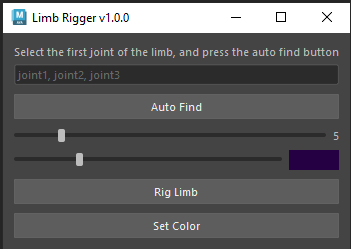
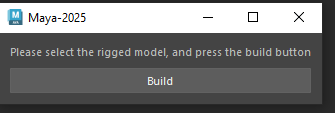

# My Maya Plugins

## Limb Rigger

 

[Limb Rigger]("./src/LimbRigger.py")
this plugin rigs 3 joint limb with ik and fk and ikfk blend.

* support auto joint finding
* controller size control
* controller color control
* changing the color of a controller after it is made

## Proxy Generator
 

[ProxyGenerator]("./src/ProxyGenerator.py")
this plugin creates a proxy model based off of the joints in a mesh

### ProxyGenerator Class

>Obtains all the functions to create the proxy model

* **BuildProxyForSelectedMesh()**
    * Runs when the Build button is clicked
    * Detects if a mesh is selected or not
    * Gets the bound skin of the mesh if it has one
    * Gets all the joints of the mesh if it has any
    * Calls 'GenerateJntVertsDict' to create a dictionary of each joint and\
    its most influenced vertex
    * Calls 'CreateProxyModelForJntAndVert' to create the proxy model\
    using the joints and vertices in the dictionary

* **CreateProxyModelForJntAndVerts(jnt, verts)**

    * If no vertices are passed into this function it is returned
    * Gets all the faces of the mesh using the vertices in the dictionary
    * Duplicates the mesh that was selected
    * Compares the faces of the duplicated mesh and the ones created
    * Deletes all the faces on the duplicate that are the same as the faces from the vertices
    * Returns the duplicated mesh with deleted faces

* **GenerateJntVertsDictionary()**
    * Creates a dictionary with joint as the key
    * Gets all the vertices in the selected mesh
    * Calls 'GetJntWithMaxInfluence' for each vertex
    * Assigns the vertex the the joints list in dictionary\
     returned by 'GetJntWithMaxInfluence'
     * Returns the dictionary populated by the joints and what vertices\
     they have the most influence over

* **GetJntWithMaxInfluence(vert, skin)**
    * Gets the joint weight values for the vertex
    * Gets the joints that influence the vertex
    * Loops through the joint weight values to find the max weight percentage
    * Returns the joint with the max  weight value of the vertex

### ProxyGeneratorWidget
> Creates the widget for the plugin
> * QLabel to tell the user what to do
> * QPushButton to run BuildProxyForSelectedMesh

* **GetWindowUniqueName**

    * returns a unique string for the windows name